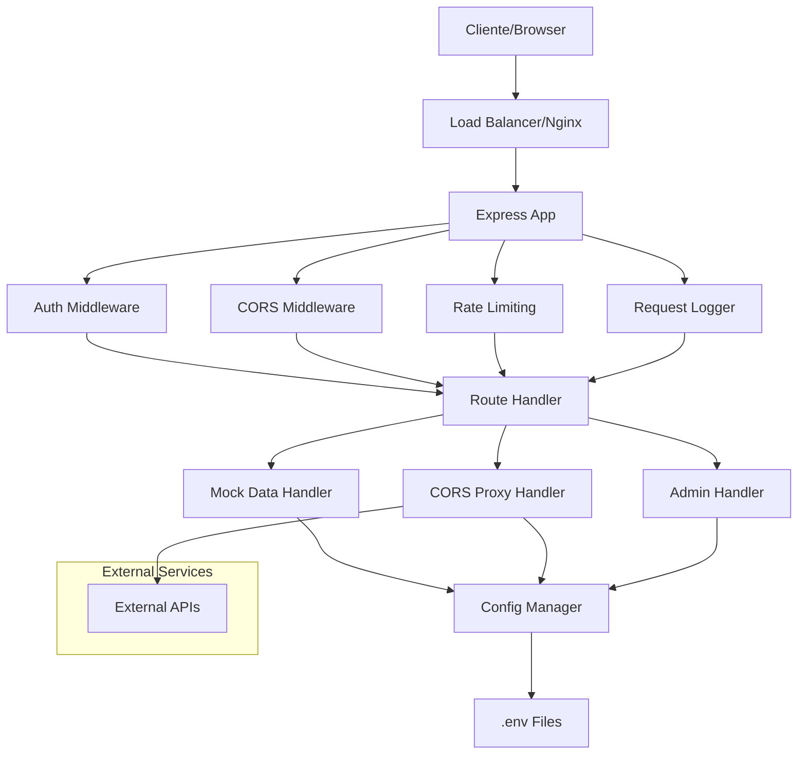

# Design Document - Mock API Server

## Overview

O Mock API Server é uma aplicação Node.js/Express que fornece funcionalidades de servidor de dados mockados e proxy CORS. A arquitetura é modular, permitindo configuração flexível através de arquivos de ambiente e suportando diferentes modos de operação para desenvolvimento e produção.

### Tecnologias Principais
- **Runtime**: Node.js
- **Framework**: Express.js
- **Autenticação**: jsonwebtoken, passport
- **Configuração**: dotenv
- **Logging**: winston
- **Validação**: joi
- **Rate Limiting**: express-rate-limit
- **CORS**: cors middleware

## Architecture



### Fluxo de Requisição

1. **Recepção**: Cliente faz requisição HTTP
2. **Middlewares**: Autenticação → CORS → Rate Limiting → Logging
3. **Roteamento**: Determina se é mock, proxy ou admin
4. **Processamento**: Executa lógica específica do endpoint
5. **Resposta**: Retorna dados com headers apropriados

## Components and Interfaces

### 1. Configuration Manager

```typescript
interface ConfigManager {
  loadConfig(environment: string): Promise<AppConfig>
  reloadConfig(): Promise<void>
  getConfig(): AppConfig
  validateConfig(config: Partial<AppConfig>): ValidationResult
}

interface AppConfig {
  server: ServerConfig
  security: SecurityConfig
  mock: MockConfig
  proxy: ProxyConfig
  logging: LoggingConfig
}

interface SecurityConfig {
  authentication: {
    enabled: boolean
    type: 'jwt' | 'basic' | 'dev-token' | 'bypass' | 'disabled'
    jwtSecret?: string
    devToken?: string
    basicCredentials?: { username: string, password: string }
  }
  cors: {
    allowedOrigins: string[]
    allowCredentials: boolean
  }
  rateLimit: {
    windowMs: number
    maxRequests: number
    skipSuccessfulRequests: boolean
  }
}
```

### 2. Authentication Service

```typescript
interface AuthService {
  validateJWT(token: string): Promise<AuthResult>
  validateBasicAuth(credentials: string): Promise<AuthResult>
  validateDevToken(token: string): boolean
  checkBypass(headers: Record<string, string>): boolean
}

interface AuthResult {
  valid: boolean
  user?: UserInfo
  error?: string
}
```

### 3. Mock Data Handler

```typescript
interface MockDataHandler {
  handleRequest(req: Request, res: Response): Promise<void>
  loadMockData(): Promise<MockDataSet>
  validateMockData(data: any): ValidationResult
}

interface MockDataSet {
  endpoints: Record<string, MockEndpoint>
}

interface MockEndpoint {
  method: string
  path: string
  response: any
  statusCode: number
  headers?: Record<string, string>
  delay?: number
}
```

### 4. CORS Proxy Handler

```typescript
interface ProxyHandler {
  handleProxyRequest(req: Request, res: Response): Promise<void>
  validateTargetUrl(url: string): boolean
  addCorsHeaders(res: Response): void
  forwardRequest(targetUrl: string, req: Request): Promise<ProxyResponse>
  handleProxyError(error: any, res: Response): void
}

interface ProxyResponse {
  status: number
  headers: Record<string, string>
  data: any
  responseTime: number
}
```

#### Como o Proxy Funciona

**Fluxo de Requisição Proxy:**

1. **Recepção da Requisição**
   - Cliente faz requisição para `/proxy?url=https://api.externa.com/endpoint`
   - Ou usa rota configurada: `/api/external/*` → `https://api.externa.com/*`

2. **Validação da URL de Destino**
   - Verifica se a URL está na lista de URLs permitidas
   - Valida formato e protocolo (https/http)
   - Bloqueia URLs maliciosas ou não autorizadas

3. **Preparação da Requisição**
   - Copia headers relevantes (exceto CORS e sensíveis)
   - Preserva método HTTP (GET, POST, PUT, DELETE)
   - Encaminha body da requisição original

4. **Execução da Requisição**
   - Faz requisição HTTP para a API externa
   - Aplica timeout configurado
   - Implementa retry com backoff exponencial

5. **Processamento da Resposta**
   - Recebe resposta da API externa
   - Adiciona headers CORS necessários
   - Remove headers sensíveis da API externa
   - Retorna resposta ao cliente original

**Configuração de Rotas Proxy:**

```typescript
// Configuração no .env
PROXY_ROUTES=jsonplaceholder:https://jsonplaceholder.typicode.com,github:https://api.github.com

// Resulta em:
// GET /proxy/jsonplaceholder/posts → https://jsonplaceholder.typicode.com/posts
// GET /proxy/github/users/octocat → https://api.github.com/users/octocat
```

**Headers CORS Adicionados:**
```typescript
const corsHeaders = {
  'Access-Control-Allow-Origin': allowedOrigin,
  'Access-Control-Allow-Methods': 'GET, POST, PUT, DELETE, OPTIONS',
  'Access-Control-Allow-Headers': 'Content-Type, Authorization, X-Requested-With',
  'Access-Control-Allow-Credentials': 'true'
}
```

### 5. Security Middleware

```typescript
interface SecurityMiddleware {
  authenticateRequest(req: Request, res: Response, next: NextFunction): void
  validateOrigin(req: Request, res: Response, next: NextFunction): void
  applyRateLimit(req: Request, res: Response, next: NextFunction): void
  detectSuspiciousActivity(req: Request): SuspiciousActivityResult
}
```

## Data Models

### Configuration Schema

```typescript
// Server Configuration
interface ServerConfig {
  port: number
  host: string
  environment: 'development' | 'production'
  adminEnabled: boolean
}

// Mock Data Configuration
interface MockConfig {
  dataPath: string
  endpoints: MockEndpoint[]
  defaultDelay: number
  enableCrud: boolean
}

// Proxy Configuration
interface ProxyConfig {
  enabled: boolean
  routes: Record<string, ProxyRoute>
  timeout: number
  retries: number
  allowedDomains: string[]
  blockedDomains: string[]
}

interface ProxyRoute {
  name: string
  targetUrl: string
  pathRewrite?: Record<string, string>
  headers?: Record<string, string>
  auth?: ProxyAuth
}

interface ProxyAuth {
  type: 'bearer' | 'basic' | 'apikey'
  token?: string
  username?: string
  password?: string
  apiKeyHeader?: string
  apiKeyValue?: string
}

// Logging Configuration
interface LoggingConfig {
  level: 'silent' | 'error' | 'warn' | 'info' | 'debug'
  format: 'json' | 'simple'
  file?: string
}
```

### Request/Response Models

```typescript
interface ApiRequest extends Request {
  user?: UserInfo
  startTime: number
  requestId: string
}

interface ApiResponse {
  success: boolean
  data?: any
  error?: ErrorInfo
  meta?: ResponseMeta
}

interface ErrorInfo {
  code: string
  message: string
  details?: any
}

interface ResponseMeta {
  timestamp: string
  requestId: string
  processingTime: number
}
```

## Error Handling

### Error Categories

1. **Authentication Errors (401)**
   - Token inválido/expirado
   - Credenciais incorretas
   - Token ausente quando requerido

2. **Authorization Errors (403)**
   - Origem não permitida
   - IP bloqueado
   - Endpoint administrativo sem permissão

3. **Client Errors (400, 404, 413, 415, 429)**
   - Payload muito grande
   - Formato não suportado
   - Rate limit excedido
   - Endpoint não encontrado

4. **Server Errors (500, 502, 503)**
   - Erro de configuração
   - Falha na API externa (proxy)
   - Erro interno do servidor

### Error Response Format

```typescript
interface ErrorResponse {
  error: {
    code: string
    message: string
    timestamp: string
    requestId: string
    details?: any
    suggestions?: string[]
  }
}
```

### Error Recovery Strategies

- **Retry Logic**: Para falhas de proxy com backoff exponencial
- **Circuit Breaker**: Para APIs externas indisponíveis
- **Graceful Degradation**: Fallback para dados estáticos quando proxy falha
- **Health Checks**: Monitoramento contínuo de dependências

## Testing Strategy

### Unit Tests
- **Configuration Manager**: Validação de configurações
- **Authentication Service**: Validação de tokens e credenciais
- **Mock Data Handler**: Processamento de dados mockados
- **Security Middleware**: Validação de origem e rate limiting

### Integration Tests
- **API Endpoints**: Testes end-to-end dos endpoints
- **Proxy Functionality**: Testes com APIs externas mockadas
- **Authentication Flow**: Fluxos completos de autenticação
- **Error Scenarios**: Cenários de erro e recuperação

### Performance Tests
- **Load Testing**: Capacidade de requisições simultâneas
- **Memory Usage**: Monitoramento de vazamentos de memória
- **Response Time**: Latência dos endpoints
- **Rate Limiting**: Efetividade dos limites de taxa

### Security Tests
- **CORS Validation**: Testes de origem cruzada
- **Authentication Bypass**: Tentativas de contorno de autenticação
- **Injection Attacks**: Proteção contra ataques de injeção
- **Rate Limit Evasion**: Tentativas de contorno de rate limiting

## Deployment Architecture

### Development Environment
```yaml
Environment: development
Security: relaxed
Authentication: dev-token or disabled
CORS: permissive
Logging: debug level
Rate Limiting: disabled or high limits
```

### Production Environment
```yaml
Environment: production
Security: strict
Authentication: JWT or HTTP Basic
CORS: restricted origins
Logging: info/warn level
Rate Limiting: enabled with strict limits
Monitoring: enabled
```

### Environment Variables Structure

```bash
# .env.local (Development)
NODE_ENV=development
PORT=3000
HOST=localhost

# Security (Relaxed)
AUTH_ENABLED=false
AUTH_TYPE=dev-token
DEV_TOKEN=dev-12345
CORS_ORIGINS=*

# Mock Data
MOCK_DATA_PATH=./data/mock
ENABLE_CRUD=true
DEFAULT_DELAY=0

# Proxy
PROXY_ENABLED=true
PROXY_TIMEOUT=5000
PROXY_ROUTES=jsonplaceholder:https://jsonplaceholder.typicode.com,github:https://api.github.com
PROXY_ALLOWED_DOMAINS=jsonplaceholder.typicode.com,api.github.com,httpbin.org

# Logging
LOG_LEVEL=debug
LOG_FORMAT=simple

# Admin
ADMIN_ENABLED=true
```

```bash
# .env.production (Production)
NODE_ENV=production
PORT=8080
HOST=0.0.0.0

# Security (Strict)
AUTH_ENABLED=true
AUTH_TYPE=jwt
JWT_SECRET=your-secret-key
CORS_ORIGINS=https://yourdomain.com,https://app.yourdomain.com

# Rate Limiting
RATE_LIMIT_WINDOW=900000
RATE_LIMIT_MAX=100

# Mock Data
MOCK_DATA_PATH=./data/production
ENABLE_CRUD=false
DEFAULT_DELAY=100

# Proxy
PROXY_ENABLED=true
PROXY_TIMEOUT=10000
PROXY_RETRIES=3
PROXY_ROUTES=api1:https://api.production.com,api2:https://service.production.com
PROXY_ALLOWED_DOMAINS=api.production.com,service.production.com
PROXY_BLOCKED_DOMAINS=malicious.com,spam.com

# Logging
LOG_LEVEL=info
LOG_FORMAT=json
LOG_FILE=./logs/app.log

# Admin
ADMIN_ENABLED=false
```

## Performance Considerations

### Caching Strategy
- **Configuration Caching**: Cache de configurações em memória
- **Mock Data Caching**: Cache de dados mockados com invalidação
- **Response Caching**: Cache de respostas de proxy para APIs lentas

### Memory Management
- **Request Pooling**: Reutilização de objetos de requisição
- **Response Streaming**: Streaming para respostas grandes
- **Garbage Collection**: Otimização para reduzir pausas de GC

### Scalability
- **Horizontal Scaling**: Suporte a múltiplas instâncias
- **Load Balancing**: Distribuição de carga entre instâncias
- **Health Checks**: Endpoints para verificação de saúde